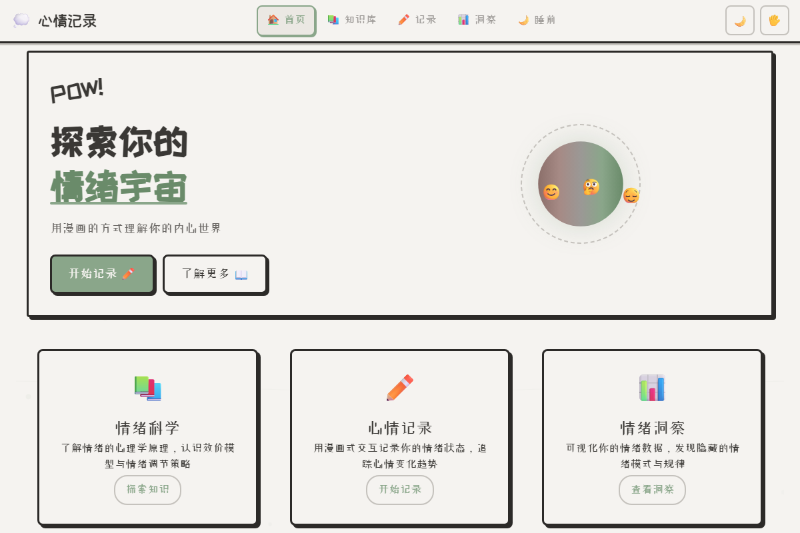
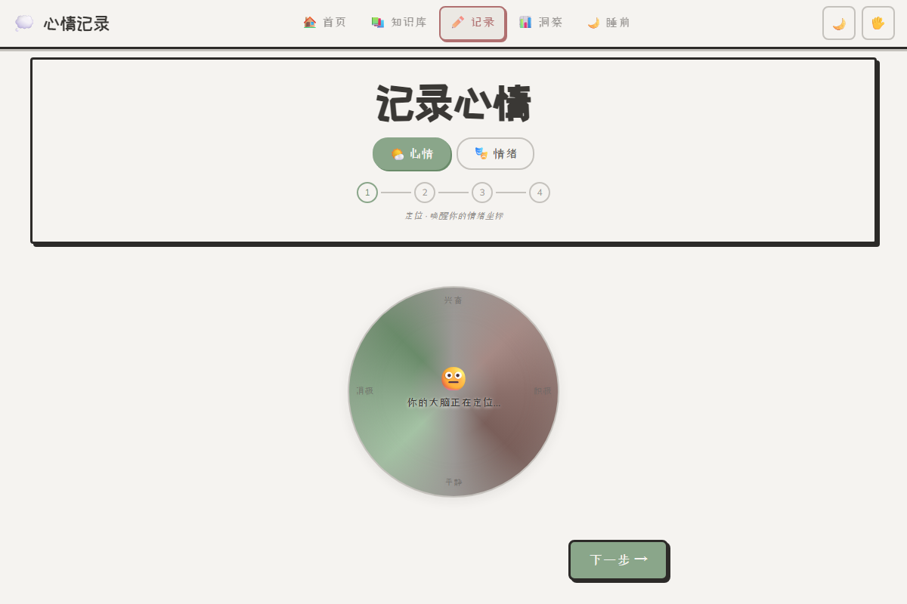
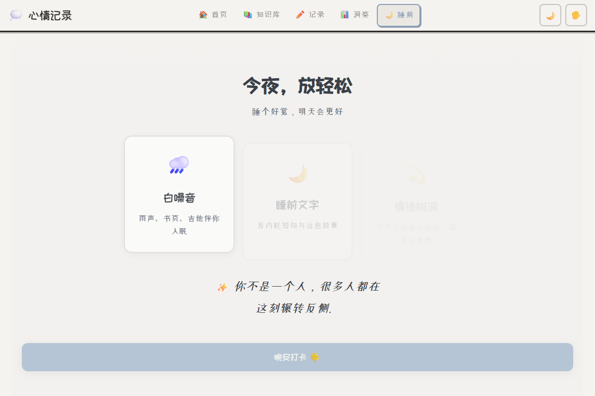

# 🌙 心情记录 - 概念交互体验

> 用漫画的方式理解你的内心世界，学习情绪科学知识

一个面向大学生的心理健康概念交互网站，融合了漫画风格UI、手势交互、沉浸式心情记录流程，以及睡前治愈模式。



## ✨ 功能特性

### 🎭 沉浸式心情记录
- **4步记录流程**：情绪定位 → 因素梳理 → 自由书写 → 心理引导
- **Valence-Arousal 2D情绪模型**：科学定位情绪坐标
- **动态情绪气泡**：带心理微文案的交互式标签
- **心理引导卡片**：记录后提供个性化心理建议

### 📚 心理知识库
- **8大知识模块**：情绪科学、压力管理、睡眠卫生、正念冥想、自我关怀、社交关系、学业心理、未来规划
- **三层知识渗透**：微文案 → 交互即学习 → 渐进解锁
- **漫画风格呈现**：轻松有趣的视觉设计

### 📊 数据洞察
- **7种图表分析**：情绪趋势、因素分布、周对比、情绪热力图等
- **本地数据存储**：隐私安全，数据不上传

### 🌙 睡前治愈模式
- **沉浸式场景**：8个精心设计的治愈场景（窗月知意、山野寄心、云间忘忧等）
- **真实音频**：14个高质量MP3音频（自然白噪音、疗愈冥想、氛围音乐）
- **睡前文字**：8篇治愈散文 + 打字机效果
- **情绪树洞**：匿名倾诉空间
- **晚安打卡**：记录每晚心境，日历回顾

### 🎨 设计哲学
- **墨脉设计哲学 v3**：每个视觉元素对应心理概念
- **心理状态色彩映射**：腹侧迷走（安全绿）、交感神经（活力玫）、背侧迷走（休憩蓝）、整合状态（理解金）
- **暗色/亮色主题**：自动适配系统偏好

## 🛠️ 技术栈

- **纯前端SPA**：无框架依赖，原生JavaScript
- **手势交互**：MediaPipe Hands + 鼠标/触控降级
- **动画引擎**：Anime.js
- **图表可视化**：Chart.js
- **音频合成**：Web Audio API
- **安全防护**：CSP/SRI/XSS防护

## 📁 项目结构

```
mood-journal-demo/
├── index.html              # 主入口
├── components/             # 页面组件
│   ├── page-home.js        # 首页
│   ├── page-record.js      # 心情记录
│   ├── page-knowledge.js   # 知识库
│   ├── page-insights.js    # 数据洞察
│   ├── page-sleep-*.js     # 睡前模式相关页面
│   └── ...
├── scripts/                # 核心逻辑
│   ├── sleep-audio.js      # 音频引擎
│   ├── sleep-quotes.js     # 内容数据
│   ├── mood-wheel.js       # 情绪轮盘
│   └── ...
├── styles/                 # 样式文件
│   ├── main.css            # 全局样式
│   ├── sleep-theme.css     # 睡前模式主题
│   └── ...
├── assets/
│   ├── audio/              # 14个MP3音频
│   └── images/             # 场景图片
└── docs/                   # 设计文档
```

## 🚀 快速开始

### 本地运行

```bash
# 克隆仓库
git clone https://github.com/Z4LIM/emotion_pow.git

# 进入目录
cd emotion_pow

# 启动本地服务器（Python 3）
python -m http.server 8099

# 访问
# http://localhost:8099
```

### 部署

项目为纯静态网站，可部署到任意静态托管平台：

- **Gitee Pages**：国内访问最快
- **Vercel**：自动部署，支持自定义域名
- **Netlify**：功能丰富
- **GitHub Pages**：国际访问友好

## 📱 截图预览

| 首页 | 心情记录 | 睡前模式 |
|------|---------|---------|
|  |  |  |

## 🎯 适用场景

- 大学生心理健康教育
- 情绪自我觉察训练
- 睡前放松与助眠
- 心理知识科普

## 📄 许可证

MIT License

## 🙏 致谢

- 情绪模型参考：Russell's Circumplex Model of Affect
- 多迷走神经理论：Stephen Porges
- 设计灵感：iOS 18 心情记录模块

---

> 💡 这是一个概念演示项目，旨在探索心理健康领域的交互设计可能性。如有心理健康问题，请寻求专业帮助。
